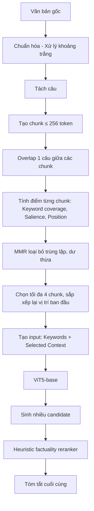

# TỔNG HỢP PROJECT: HLK-ViT5

## 1. Tổng quan đề tài

- **Tên Model:** HLK-ViT5
- **Phương pháp:** Tóm tắt abstract dựa trên ViT5-base. Thực hiện huấn luyện fine-tune kết hợp kỹ thuật.
- **Cải tiến:**
  - **Cải tiến lớn nhất (Selective Long-Context):** Model không chỉ nhìn đầu văn bản, mà nó nhìn toàn bộ.
  - **Sentence-aware chunking:** Chia văn bản dài theo câu.
  - **Overlapping chunks:** Giữ 1 câu giao nhau để không mất ngữ cảnh.
  - **Selective long-context:** Xét toàn văn rồi chỉ lấy vùng quan trọng.
  - **Keyword-guided chunk selection:** Từ khóa quyết định chunk nào đáng giữ.
  - **Salience scoring:** Ưu tiên đoạn chứa từ nổi bật/chủ đề.
  - **MMR:** Chọn đoạn quan trọng không trùng nội dung.
  - **Keyword-conditioned generation:** Đưa keyword trực tiếp vào ViT5.
  - **Input lên đến 1024:** Cho ViT5 nhìn nhiều nội dung hơn.
  - **Heuristic factuality reranking:** Chọn candidate bám sát nguồn hơn.
  - **Entity consistency:** Hạn chế bịa thông tin.

## 2. Cơ sở mô hình

- VietAI/ViT5-base

## 3. Dataset

- **Nguồn:** Bộ dữ liệu corpus nội địa được xây dựng và tổng hợp trực tiếp từ domain **tienphong.vn**.
- **Kích thước:** Tập train gồm 15620 mẫu.

## 4. Ý tưởng pipeline



_(Chi tiết flow: Chuẩn hóa → Tách câu → Tạo chunk ≤ 256 token → Overlap 1 câu → Tính điểm từng chunk → MMR → Chọn max 4 chunk → Tạo input → ViT5-base → Sinh candidates → Rerank → Tóm tắt cuối)_

## 5. So sánh với những mô hình nào?

- **Model Nishikyen/vit5-vietnamese-news:** (Sử dụng vit5-base)
- **Model thnhan/sft_model:** (Sử dụng vit5-base)

## 7. Các độ đo cần so sánh

### Nhóm 1: Lexical overlap (Độ chồng lặp từ vựng)

| Độ đo   | HKL-ViT5 | Nishikyen/vit5-vietnamese-news | thnhan/sft_model |
| ------- | -------- | ------------------------------ | ---------------- |
| Rouge-1 |          |                                |                  |
| Rouge-2 |          |                                |                  |
| Rouge-L |          |                                |                  |

### Nhóm 2: Semantic quality (Chất lượng ngữ nghĩa)

| Độ đo               | HKL-ViT5 | Nishikyen/vit5-vietnamese-news | thnhan/sft_model |
| ------------------- | -------- | ------------------------------ | ---------------- |
| BERTScore Precision |          |                                |                  |
| BERTScore Recall    |          |                                |                  |
| BERTScore F1        |          |                                |                  |

### Nhóm 3: Factual consistency (Tính nhất quán về sự thật)

_(Nếu không đủ thời gian, có thể bỏ 2 trong 4 độ đo này)_
| Độ đo | HKL-ViT5 | Nishikyen/vit5-vietnamese-news | thnhan/sft_model |
|---|---|---|---|
| Entity precision | | | |
| Number consistency | | | |
| Contradiction rate | | | |
| Hallucination rate | | | |

### Nhóm 4: Performance (Hiệu năng)

| Độ đo          | HKL-ViT5 | Nishikyen/vit5-vietnamese-news | thnhan/sft_model |
| -------------- | -------- | ------------------------------ | ---------------- |
| Inference time |          |                                |                  |

## 8. Format đầu ra của từng bản tóm tắt:

Mỗi file `.txt` có định dạng:

```text
INDEX:
<index>
GUID:
<guid>
TITLE:
<title>
VĂN BẢN GỐC:
<văn bản gốc>
TÓM TẮT DO MODEL SINH:
<tóm tắt của model đó>
THỜI GIAN TÓM TẮT:
<thời gian tóm tắt ghi ở đây>
---Hết---
```
