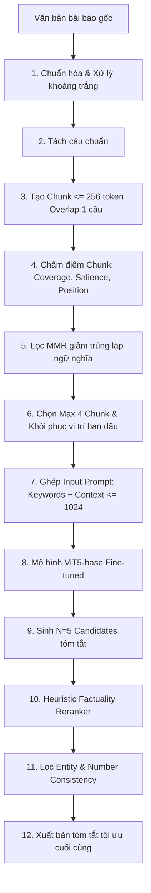

# HLK-ViT5: Cải tiến mô hình ViT5 dựa trên kỹ thuật Chọn lọc ngữ cảnh dài và Reranking cho Bài toán Tóm tắt văn bản Tiếng Việt

> **Báo cáo Bài tập lớn Học phần Xử lý Ngôn ngữ Tự nhiên (NLP)**  
> **Trường Đại học Công nghệ — Đại học Quốc gia Hà Nội (UET - VNU)**  
> **Giáo viên hướng dẫn:** TS. Trần Hồng Việt  
> **Năm học:** 2026

---

## 👥 Nhóm sinh viên thực hiện

| STT | Họ và tên            | Mã sinh viên | Vai trò & Nhiệm vụ chính                                           |
| :-: | :------------------- | :----------: | :----------------------------------------------------------------- |
|  1  | **Phạm Vân Anh**     |   22028099   | Xây dựng evaluation service, script đánh giá                       |
|  2  | **Bùi Đức Duy**      |   22021201   | Phối hợp báo cáo & Thuyết trình                                    |
|  3  | **Lê Văn Thắng**     |   22028313   | Thực nghiệm đối chứng & Thống kê và soạn thảo báo cáo              |
|  4  | **Nguyễn Tiến Mạnh** |   24020220   | Thiết kế Pipeline HLK-ViT5 (Selective Long-Context, MMR, Reranker) |

---

## 📌 Tổng quan đề tài

Tóm tắt văn bản tự động (Abstractive Text Summarization) cho tiếng Việt ngữ cảnh dài vẫn còn chịu hai rào cản lớn:

1. **Giới hạn cửa sổ ngữ cảnh (Context Window Limitation):** Các mô hình `ViT5-base` chuẩn bị giới hạn đầu vào 256–512 tokens, dẫn đến hiện tượng trích đoạn đầu (_lead bias_) và bỏ sót dữ kiện quan trọng ở giữa/cuối bài báo.
2. **Ảo giác thông tin & Mất nhất quán thực thể (Hallucination & Factual Inconsistency):** Mô hình sinh câu có xu hướng bịa thêm thông tin hoặc nhầm lẫn giữa các con số, tên riêng so với bài gốc.

Dự án đề xuất kiến trúc **HLK-ViT5**, một pipeline cải tiến 13 bước toàn diện giúp mở rộng đầu vào lên **1024 tokens** mà không bị dính dư thừa ngữ nghĩa, đồng thời tích hợp bộ lọc xếp hạng lại tính xác thực (_Heuristic Factuality Reranker_) để kéo giảm tối đa hiện tượng ảo giác.

---

## 🚀 Các điểm cải tiến kỹ thuật cốt lõi (Core Contributions)

- **Selective Long-Context (Input up to 1024 Tokens):**
  - **Sentence-aware Chunking:** Phân đoạn văn bản dựa trên ranh giới câu chuẩn xác.
  - **1-Sentence Overlapping:** Giữ 1 câu đè giữa các chunk kề nhau ($\le 256$ token) để bảo toàn tính liên kết.
  - **Salience Scoring & MMR:** Chấm điểm nổi bật (Coverage + Salience + Position) và lọc qua thuật toán _Maximal Marginal Relevance (MMR)_ chọn ra tối đa 4 chunk đại diện nhất từ toàn văn bài báo mà không trùng lặp.
- **Keyword-conditioned Generation:** Nhúng danh sách từ khóa chủ đề trực tiếp vào đầu chuỗi prompt ViT5 để định hướng cơ chế chú ý (Cross-Attention).
- **Heuristic Factuality Reranking:** Sinh $N=5$ bản tóm tắt ứng viên và xếp hạng lại dựa trên độ chính xác danh từ riêng (_Entity Precision_) và tính nhất quán con số (_Number Consistency_).

---

## 🔄 Kiến trúc Pipeline HLK-ViT5 (13 Bước)



---

## 📊 Kết quả thực nghiệm đối chứng (Benchmark Results)

Được đánh giá độc lập trên **300 mẫu báo chí tiếng Việt** (từ domain _tienphong.vn_) đối chiếu với 2 mô hình baseline mã nguồn mở:

- **`Nishikyen/vit5-vietnamese-news`** (ViT5-base fine-tune chuẩn)
- **`thnhan/sft_model`** (ViT5-base SFT)

### Bảng tổng hợp 4 nhóm chỉ số đánh giá (Evaluation Summary)

| Nhóm chỉ số             | Độ đo                  | HKL-ViT5 (Ours) | Nishikyen/vit5-news | thnhan/sft_model | Đánh giá / Ý nghĩa                                          |
| :---------------------- | :--------------------- | :-------------: | :-----------------: | :--------------: | :---------------------------------------------------------- |
| **1. Lexical Overlap**  | **ROUGE-1**            |   **0.5184**    |       0.4707        |      0.4321      | **Dẫn đầu (+4.77% ROUGE-1)** nhờ bao quát ngữ cảnh toàn văn |
|                         | **ROUGE-2**            |   **0.2932**    |       0.2510        |      0.2227      | Khôi phục chính xác các cụm bigram quan trọng               |
|                         | **ROUGE-L**            |   **0.3434**    |       0.3148        |      0.2773      | Chuỗi con chung dài nhất đạt độ bám từ cao nhất             |
| **2. Semantic Quality** | **BERTScore F1**       |   **0.9008**    |       0.8934        |      0.8874      | Tương đồng ngữ nghĩa tốt nhất (PhoBERT / XLM-R)             |
|                         | **BERTScore Recall**   |   **0.9020**    |       0.8896        |      0.8790      | Đảm bảo bao hàm đầy đủ các ý chính                          |
| **3. Factuality**       | **Entity Precision**   |   **81.81%**    |       79.16%        |      76.57%      | Xác nhận chính xác 706/863 thực thể (UNDERTHESEA)           |
|                         | **Number Consistency** |   **98.54%**    |       96.46%        |      97.55%      | Tiệm cận tuyệt đối (472/479 con số chính xác)               |
|                         | **Contradiction Rate** |    **2.11%**    |        2.90%        |      3.99%       | Mâu thuẫn logic cực thấp (mDeBERTa NLI)                     |
|                         | **Hallucination Rate** |   **39.04%**    |       45.53%        |      48.45%      | **Kéo giảm ảo giác ~6.5%** nhờ bộ Reranker                  |
| **4. Performance**      | **Inference Time**     |    8.0535 s     |    **3.5313 s**     |     6.1358 s     | Đánh đổi thời gian chạy 5 candidates để lấy chất lượng      |

---

## 📁 Cấu trúc thư mục dự án (Repository Structure)

```text
NLP-MoA-TextSummarization/
├── README.md                           # Thuyết minh dự án & Hướng dẫn sử dụng
├── HLK_ViT5.ipynb                      # Jupyter Notebook huấn luyện fine-tune & thử nghiệm
├── HLK-ViT5_Project_Overview.md        # Tổng quan thiết kế kỹ thuật HLK-ViT5
├── requirements.txt                    # Danh sách thư viện Python phụ thuộc
│
├── utils/
│   ├── evaluate_3_models.py            # Script tự động tính 4 nhóm độ đo trên 300 mẫu test
│   ├── nishikyen_summary.py            # Script gọi model NishiKyen/vit5-vietnamese-news để tạo 300 mẫu test
│   └── sft_model_summary.py            # Script gọi model thnhan3/sft_model để tạo 300 mẫu test
│
├── output/
│   └── evaluation/                     # Kết quả thực nghiệm định lượng
│       ├── evaluation_report.md        # Báo cáo đánh giá tổng hợp Markdown
│       ├── evaluation_report.txt       # Báo cáo đánh giá dạng Text
│       ├── metrics_summary.json        # File JSON lưu thông số chi tiết của 3 mô hình
│       └── per_sample_metrics.csv      # Bảng kết quả chấm điểm từng mẫu (300 rows x 33 cols)
│
├── results/                            # Kết quả tóm tắt dạng TXT của 3 mô hình
│   ├── vit5-base-HLK-0001/             # Đầu ra của HKL-ViT5 (test_predictions_txt/)
│   ├── nishikyen/                      # Đầu ra của Nishikyen/vit5-vietnamese-news
│   └── sft_model/                      # Đầu ra của thnhan/sft_model
│
├── w-latex-reports/                    # Báo cáo Bài tập lớn LaTeX (PDF 26 trang)
│   ├── thesis.pdf                      # PDF Báo cáo chính thức
│   ├── thesis.tex                      # File LaTeX tổng
│   ├── cover.tex                       # Trang bìa chuẩn UET
│   ├── references.bib                  # Thư viện trích dẫn BibTeX
│   └── chapters/                       # 6 Chương báo cáo theo cấu trúc IMRaD
│
└── w-slides-presentation/              # Slide thuyết trình báo cáo
```

---

## 🛠️ Hướng dẫn cài đặt & Thiết lập thực nghiệm

### 1. Yêu cầu môi trường

- Python $\ge 3.10$
- PyTorch $\ge 2.1.2$ (khuyên dùng CUDA GPU $\ge 12GB$ VRAM)
- Thư viện NLP: `transformers`, `datasets`, `underthesea`, `bert-score`, `sentencepiece`

### 2. Cài đặt các thư viện cần thiết

```bash
git clone https://github.com/thnglee/NLP-MoA-TextSummarization.git
cd NLP-MoA-TextSummarization
pip install -r requirements.txt
```

### 3. Cài đặt model từ huggingface

`hf download tmanh217/hlk-vit5 --local-dir models/ViT5-base-HLK-0001`

### 4. Tái lập quá trình đánh giá tự động 3 mô hình (Evaluation Benchmark)

Để tính toán lại toàn bộ 4 nhóm chỉ số (ROUGE, BERTScore, Entity Precision, Number Consistency, NLI Hallucination, Inference Time) trên 300 mẫu kiểm thử:

```bash
python utils/evaluate_3_models.py \
    --results-dir results \
    --output-dir output/evaluation \
    --device cuda \
    --bert-batch-size 8 \
    --nli-batch-size 8
```

> **Mẹo chạy nhanh trên CPU (Bỏ qua BERTScore & NLI heavy models):**
>
> ```bash
> python utils/evaluate_3_models.py --results-dir results --output-dir output/evaluation --skip-bertscore --skip-nli
> ```

Kết quả tự động xuất ra thư mục `output/evaluation/` gồm `evaluation_report.md`, `metrics_summary.json` và `per_sample_metrics.csv`.

---

## 📄 Định dạng tệp kết quả tóm tắt (.txt)

Mỗi file kết quả tóm tắt kiểm thử được lưu trữ dưới chuẩn:

```text
INDEX:
0
GUID:
tp-2026-0810-0001
TITLE:
Bộ Giáo dục và Đào tạo công bố phương án thi tốt nghiệp THPT từ năm 2025
VĂN BẢN GỐC:
Bộ Giáo dục và Đào tạo chính thức công bố phương án tổ chức kỳ thi tốt nghiệp THPT...
TÓM TẮT THAM CHIẾU:
Bộ GD&ĐT công bố phương án thi tốt nghiệp THPT từ năm 2025 với 4 môn thi...
TÓM TẮT DO MODEL SINH:
Bộ GD&ĐT ban hành phương án thi tốt nghiệp THPT 2025 gồm 2 môn bắt buộc và 2 môn tự chọn...
THỜI GIAN TÓM TẮT:
8.05 giây
---Hết---
```

---

## 🎓 Sản phẩm:

1. 📄 **Báo cáo hoàn chỉnh (LaTeX PDF):** `w-latex-reports/thesis.pdf`
2. 📊 **Báo cáo Đánh giá thực nghiệm chi tiết:** `output/evaluation/evaluation_report.md` & `metrics_summary.json`.
3. 💻 **Mã nguồn Pipeline & Notebook:** `HLK_ViT5.ipynb` & `utils/evaluate_3_models.py`.
4. 🖥️ **Slide thuyết trình báo cáo:** Thư mục `w-slides-presentation/`.

---

## 📜 Giấy phép (License)

Dự án được phát hành dưới giấy phép [MIT License](LICENSE).
