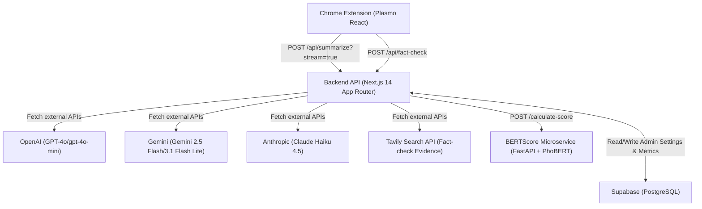
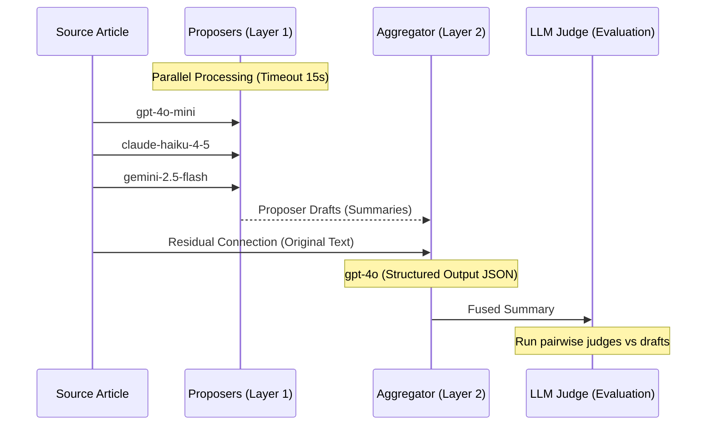

# CẨM NANG KỸ THUẬT & HƯỚNG DẪN BẢO VỆ KHÓA LUẬN TỐT NGHIỆP
**Đề tài:** Nghiên cứu, xây dựng hệ thống tóm tắt và kiểm chứng tin tức tiếng Việt sử dụng mô hình ngôn ngữ lớn.  
**Sinh viên thực hiện:** Lê Văn Thắng (MSV: 22028313)  
**Giảng viên hướng dẫn:** TS. Vương Thị Hồng  

Tài liệu này được biên soạn nhằm giúp bạn hiểu sâu sắc toàn bộ mã nguồn, cấu trúc dịch vụ, các công thức toán học/NLP cốt lõi và kết quả thực nghiệm đạt được để tự tin trả lời mọi câu hỏi chất vấn từ Hội đồng bảo vệ khóa luận.

---

## MỤC LỤC
1. [Kiến Trúc Hệ Thống (System Architecture)](#1-kiến-trúc-hệ-thống-system-architecture)
2. [Chi Tiết Mã Nguồn & Luồng Nghiệp Vụ Core](#2-chi-tiết-mã-nguồn--luồng-nghiệp-vụ-core)
3. [Mixture-of-Agents (MoA) Output Fusion Pipeline](#3-mixture-of-agents-moa-output-fusion-pipeline)
4. [Các Công Thức Kỹ Thuật (Backend & NLP Metrics)](#4-các-công-thức-kỹ-thuật-backend--nlp-metrics)
5. [Các Công Thức Đánh Giá Nghiên Cứu (Research Evaluation & Math)](#5-các-công-thức-đánh-giá-nghiên-cứu-research-evaluation--math)
6. [Phân Tích Kết Quả Thực Nghiệm Đạt Được (Thesis-Decisive Numbers)](#6-phân-tích-kết-quả-thực-nghiệm-đạt-được-thesis-decisive-numbers)
7. [Kịch Bản Trả Lời Chất Vấn Thường Gặp (Q&A Prep)](#7-kịch-bản-trả-lời-chất-vấn-thường-gặp-qa-prep)

---

## 1. KIẾN TRÚC HỆ THỐNG (SYSTEM ARCHITECTURE)

Hệ thống được thiết kế theo kiến trúc **3 lớp (Three-Tier Architecture)** tương tác đồng bộ qua giao thức HTTP (REST) và Server-Sent Events (SSE) để truyền dữ liệu thời gian thực (streaming):

### Chi tiết các thành phần:
1. **Lớp Client (Browser Extension - `extension/`):**
   - Sử dụng framework **Plasmo** (React + TypeScript) cho phép đóng gói Chrome Extension dưới dạng Manifest V3.
   - **[contents/summary-sidebar.tsx](file:///Users/thanglee/something%20beautiful/UniThesis/extension/contents/summary-sidebar.tsx)**: Content script được tự động tiêm vào các trang báo tiếng Việt được hỗ trợ. Nó chịu trách nhiệm trích xuất cấu trúc văn bản gốc trong DOM (dùng `@mozilla/readability` kết hợp JSDOM ảo hóa) và giao tiếp với Backend qua SSE.
   - **[contents/modal.tsx](file:///Users/thanglee/something%20beautiful/UniThesis/extension/contents/modal.tsx)**: Hỗ trợ người dùng bôi đen đoạn văn bản bất kỳ để kích hoạt pop-up Fact-Check (Kiểm chứng tin tức).

2. **Lớp Application Server (Backend - `backend/`):**
   - Phát triển trên **Next.js 14** (sử dụng App Router) viết bằng TypeScript.
   - Quản lý các logic trung tâm: Định tuyến phức tạp (Complexity-based routing), Triển khai MoA Pipeline, Tính toán chi phí API, Lưu trữ lịch sử và chỉ số đánh giá.
   - **[app/api/summarize/route.ts](file:///Users/thanglee/something%20beautiful/UniThesis/backend/app/api/summarize/route.ts)**: Đầu mối định tuyến xử lý tóm tắt (hỗ trợ 4 chế độ: `auto`, `forced`, `fusion`, `evaluation`).

3. **Lớp Semantic Metric (BERTScore Service - `bert/`):**
   - Viết bằng Python (FastAPI), chạy trên CPU và được đóng gói Docker để deploy lên Hugging Face Spaces (Free Tier).
   - Sử dụng thư viện `bert_score` kết hợp mô hình ngôn ngữ tiếng Việt pre-trained **`vinai/phobert-base`** nhằm tính toán độ tương đồng ngữ nghĩa.

4. **Lớp Dữ Liệu (Database - Supabase):**
   - Cơ sở dữ liệu PostgreSQL lưu trữ cấu hình hệ thống (`app_settings`), lịch sử định tuyến (`routing_decisions`), kết quả tóm tắt cùng độ đo tương ứng (`evaluation_metrics`), chi tiết MoA (`moa_fusion_results`, `moa_draft_results`), và dữ liệu đánh giá từ con người (`human_eval_tasks`, `human_eval_responses`).

---

## 2. CHI TIẾT MÃ NGUỒN & LUỒNG NGHIỆP VỤ CORE

### 2.1 Luồng Định Tuyến Thông Minh (Complexity-Based Routing)
Nằm tại **[routing.service.ts](file:///Users/thanglee/something%20beautiful/UniThesis/backend/services/routing.service.ts)**. Mục tiêu là tối ưu hóa giữa **Chi phí (Cost)**, **Thời gian phản hồi (Latency)** và **Chất lượng tóm tắt (Quality)**:
1. **Ước lượng độ dài văn bản (Token Estimation):** Tính nhanh qua tỷ lệ trung bình: $\text{Tokens} = \frac{\text{Length of Characters}}{4}$.
2. **Phân loại độ phức tạp (Complexity Classification):**
   - **Short (Ngắn - $\le 400$ tokens):** Định tuyến sang model nhỏ, chuyên biệt tiếng Việt **ViT5-large** (`VietAI/vit5-large-vietnews-summarization`) thông qua HuggingFace Inference API.
   - **Medium (Trung bình - $\le 1500$ tokens):** Thử nghiệm định tuyến sang local/private model như **PhoGPT** (đang phát triển), mặc định fallback sang các dòng giá rẻ như **GPT-4o-mini**.
   - **Long (Dài - $> 1500$ tokens):** Chuyển trực tiếp lên mô hình mạnh nhất **GPT-4o**.
3. **Cơ chế Fallback Chain:** Nếu model ưu tiên trong chuỗi gặp sự cố (Timeout hoặc quá tải hạn ngạch API), hệ thống sẽ tự động đi tiếp trong danh sách fallback để đảm bảo không đứt gãy trải nghiệm người dùng.

### 2.2 Luồng Lưu Trữ Đánh Giá Bất Đồng Bộ (Asynchronous Metric Pipeline)
Trong hàm **[performSummarize](file:///Users/thanglee/something%20beautiful/UniThesis/backend/services/summarize.service.ts#L26)** và Route Handler, quá trình tính toán metrics đánh giá và lưu trữ vào database được thực hiện **bất đồng bộ (fire-and-forget)**.
Sau khi Backend trả kết quả tóm tắt về cho client (hoặc kết thúc stream), một thread nền chạy `Promise.all` song song các tác vụ sau:
- Tính toán metrics từ vựng (ROUGE-1/2/L, BLEU-4) thông qua **[evaluation.service.ts](file:///Users/thanglee/something%20beautiful/UniThesis/backend/services/evaluation.service.ts)**.
- Gửi yêu cầu đo BERTScore sang dịch vụ PhoBERT thông qua **[bert.service.ts](file:///Users/thanglee/something%20beautiful/UniThesis/backend/services/bert.service.ts)**.
- Chạy LLM-Judge chấm điểm Rubric (B.1) thông qua **[llm-judge.runner.ts](file:///Users/thanglee/something%20beautiful/UniThesis/backend/services/llm-judge.runner.ts)**.
- Đánh giá Factuality (B.3) thông qua **[factuality.runner.ts](file:///Users/thanglee/something%20beautiful/UniThesis/backend/services/factuality.runner.ts)**.

---

## 3. MIXTURE-OF-AGENTS (MoA) OUTPUT FUSION PIPELINE

Đây là **đóng góp kỹ thuật quan trọng nhất** của khóa luận, phỏng theo kiến trúc của Wang và các cộng sự (2024), nhưng được tối ưu hóa cho bài toán tóm tắt văn bản tin tức tiếng Việt.

### 3.1 Quy trình hoạt động (2 lớp - Layer 1 & Layer 2)
Được triển khai trong **[moa.service.ts](file:///Users/thanglee/something%20beautiful/UniThesis/backend/output-fusion/moa.service.ts)**:

1. **Layer 1 - Proposer Agents (Song song):**
   - Hệ thống gọi đồng thời 3 LLM thuộc phân khúc hiệu năng cao - chi phí thấp (Affordable Tier) để tạo ra 3 bản tóm tắt nháp (Drafts):
     - **GPT-4o-mini** (OpenAI)
     - **Claude Haiku 4.5** (Anthropic)
     - **Gemini 2.5 Flash** (Google)
   - Sử dụng cơ chế timeout `15_000ms`. Nếu có mô hình lỗi, chỉ cần tối thiểu `minSuccessfulDrafts = 2` mô hình thành công là pipeline tiếp tục.
2. **Layer 2 - Aggregator Agent (Tổng hợp):**
   - Mô hình mạnh nhất **GPT-4o** được cấu hình làm Aggregator. Nó nhận đầu vào là danh sách các bản nháp từ Layer 1 và tiến hành tổng hợp qua hàm **[buildAggregatorPrompt](file:///Users/thanglee/something%20beautiful/UniThesis/backend/output-fusion/moa.prompt.ts#L36)**.

### 3.2 Domain Adaptation: Residual Connection (Kết nối thặng dư nguồn)
- **Vấn đề của thuật toán gốc (Wang et al., 2024):** MoA nguyên bản được thiết kế cho các tác vụ sinh tự do (Instruction-following) như AlpacaEval, trong đó Aggregator chỉ nhận các câu trả lời nháp từ proposers mà *không* cần tham chiếu tài liệu gốc. Nếu áp dụng trực tiếp vào tóm tắt tin tức, Aggregator sẽ rất dễ bị ảo giác (hallucination) do kế thừa lỗi sai từ các proposers hoặc tự bịa thông tin.
- **Giải pháp cải tiến (Đóng góp của khóa luận):** Thiết lập **Residual Connection** (Kết nối thặng dư) bằng cách truyền trực tiếp văn bản gốc của bài viết báo chí tiếng Việt vào context của Aggregator song song với các drafts (thể hiện qua Equation 1 trong báo cáo lý thuyết).
- **Behavioral Evidence:** Thực nghiệm trên nhánh `fix/moa-aggregator-source-prompt` (Falsification Study) chứng minh: **Có văn bản nguồn giúp duy trì Factuality ở mức cao (92.3%)**, trong khi lược bỏ nguồn khiến hệ thống suy giảm độ chính xác trầm trọng mặc dù độ trơn tru câu chữ tăng lên.

---

## 4. CÁC CÔNG THỨC KỸ THUẬT (BACKEND & NLP METRICS)

### 4.1 Ước lượng chi phí API (Estimated Cost Calculation)
Nằm trong hàm `computeEstimatedCost` ở **[moa.service.ts](file:///Users/thanglee/something%20beautiful/UniThesis/backend/output-fusion/moa.service.ts#L54)**:
$$\text{Estimated Cost (USD)} = \left( \frac{\text{Prompt Tokens}}{1,000,000} \times \text{Input Cost per 1M} \right) + \left( \frac{\text{Completion Tokens}}{1,000,000} \times \text{Output Cost per 1M} \right)$$
Giá tiền được cấu hình động theo từng mô hình trong bảng `model_configurations`.

### 4.2 Metrics từ vựng (Lexical Overlap Metrics)
Được triển khai trong **[rouge-custom.ts](file:///Users/thanglee/something%20beautiful/UniThesis/backend/utils/rouge-custom.ts)** và gói `bleu-score` tại **[evaluation.service.ts](file:///Users/thanglee/something%20beautiful/UniThesis/backend/services/evaluation.service.ts#L59)**.
Do đánh giá so khớp với văn bản nguồn, công thức ở đây sử dụng **Recall-based ROUGE** để đo lường tỷ lệ giữ lại nội dung gốc:

1. **ROUGE-N (N-gram Recall):**
   $$\text{ROUGE-N} = \frac{\sum_{\text{gram}_n \in \text{Reference}} \text{Count}_{\text{match}}(\text{gram}_n)}{\sum_{\text{gram}_n \in \text{Reference}} \text{Count}(\text{gram}_n)}$$
   - $\text{ROUGE-1}$ đo mức độ giữ lại các từ đơn (Unigram).
   - $\text{ROUGE-2}$ đo mức độ giữ lại các cụm hai từ liền kề (Bigram).
   - *Tokenization:* Sử dụng `natural.WordTokenizer()` chuyển đổi văn bản thành chữ thường và loại bỏ ký tự đặc biệt. Vì là tiếng Việt không dấu hoặc có dấu, tokenization tách theo âm tiết (syllable), ví dụ "Hà Nội" tách thành `["hà", "nội"]`.

2. **ROUGE-L (Longest Common Subsequence Recall):**
   $$\text{ROUGE-L} = \frac{\text{LCS}(\text{Candidate}, \text{Reference})}{\text{Length of Reference Tokens}}$$
   - $\text{LCS}(X, Y)$ là chuỗi con chung dài nhất giữa bản tóm tắt và bài viết gốc, được tính toán thông qua giải thuật Quy hoạch động với độ phức tạp $O(M \times N)$ thời gian và không gian trong hàm `lcsLength`.

3. **BLEU-4 (Brevity Penalty + n-gram Precision):**
   Đo mức độ chính xác của n-gram với hình phạt ngắn (Brevity Penalty - BP) để tránh các bản tóm tắt quá ngắn đạt điểm tuyệt đối:
   $$\text{BLEU} = \text{BP} \times \exp \left( \sum_{n=1}^{4} w_n \ln p_n \right)$$
   Với $p_n$ là độ chính xác của n-gram và $w_n = 0.25$.

### 4.3 Semantic Similarity (BERTScore với PhoBERT)
Được định nghĩa trong microservice Python **[main.py](file:///Users/thanglee/something%20beautiful/UniThesis/bert/main.py)**:
- Thay vì so khớp chính xác từng ký tự (lexical), BERTScore sử dụng mô hình **PhoBERT** (`vinai/phobert-base`) để sinh vector biểu diễn ngữ nghĩa (contextual embeddings) cho từng token.
- Ma trận cosine similarity được tính toán giữa mọi cặp token của Candidate ($x$) và Reference ($y$).
- **BERTScore F1** được tính từ Recall ($R_{\text{BERT}}$) và Precision ($P_{\text{BERT}}$):
  $$R_{\text{BERT}} = \frac{1}{|y|} \sum_{y_i \in y} \max_{x_j \in x} \mathbf{E}(y_i) \cdot \mathbf{E}(x_j)^\top$$
  $$P_{\text{BERT}} = \frac{1}{|x|} \sum_{x_j \in x} \max_{y_i \in y} \mathbf{E}(y_i) \cdot \mathbf{E}(x_j)^\top$$
  $$F_1 = 2 \times \frac{P_{\text{BERT}} \times R_{\text{BERT}}}{P_{\text{BERT}} + R_{\text{BERT}}}$$
- *Lưu ý kỹ thuật:* PhoBERT có giới hạn độ dài chuỗi đầu vào tối đa là **256 tokens**. Dịch vụ thực hiện cắt gọn (truncation) an toàn thông qua chính Tokenizer của PhoBERT để tránh lỗi tràn chỉ mục (out-of-bounds index errors) trên Hugging Face Spaces.

### 4.4 Compression Rate (Tỷ lệ nén văn bản)
Cơ chế đếm token dựa trên bộ mã hóa **`cl100k_base`** (bộ mã hóa của các dòng GPT-4) tại **[compression.service.ts](file:///Users/thanglee/something%20beautiful/UniThesis/backend/services/compression.service.ts#L78)**:
$$\text{Compression Rate (\%)} = \left( \frac{\text{Tokens of Summary}}{\text{Tokens of Original Text}} \right) \times 100$$
Chỉ số này càng thấp thể hiện mức độ nén thông tin càng cao.

---

## 5. CÁC CÔNG THỨC ĐÁNH GIÁ NGHIÊN CỨU (RESEARCH EVALUATION & MATH)

Để chứng minh tính hiệu quả của mô hình khoa học, khóa luận sử dụng các kỹ thuật thống kê chuẩn mực:

### 5.1 Đánh giá thực tế thông tin (B.3 Factuality Score)
Được triển khai trong **[factuality.service.ts](file:///Users/thanglee/something%20beautiful/UniThesis/backend/services/factuality.service.ts#L166)**:
- **Bước 1 (Claim Splitting):** Tách bản tóm tắt thành tập hợp các luận điểm nguyên tử độc lập (atomic claims).
- **Bước 2 (Entailment Verification):** Sử dụng `gpt-4o-mini` đối chiếu từng luận điểm với bài báo gốc để phân loại thành 3 nhãn:
  - **`entailed`**: Được hỗ trợ bởi bài báo gốc.
  - **`contradicted`**: Mâu thuẫn (Đặc trưng cho Ảo giác - Hallucination).
  - **`not_mentioned`**: Không được nhắc tới trong nguồn.
- **Công thức tính tỷ lệ chính xác thông tin (Entailment Ratio):**
  $$\text{Entailment Ratio} = \frac{\text{Số lượng luận điểm đạt nhãn 'entailed'}}{\text{Tổng số lượng luận điểm được trích xuất}}$$

### 5.2 Kiểm định thống kê Sign Test (Binomial Sign Test)
Được triển khai thủ công tại **[stats.ts](file:///Users/thanglee/something%20beautiful/UniThesis/backend/output-fusion/scripts/stats.ts#L58)** để kiểm tra sự vượt trội của mô hình MoA có ý nghĩa thống kê hay chỉ do ngẫu nhiên.
- Giả thuyết không $\text{H}_0: P(\text{Fused thắng}) = 0.5$ (tỷ lệ thắng của hai bên ngang nhau).
- Loại bỏ các cặp hòa (ties). Gọi số bài Fused thắng là $w$, số bài đối thủ thắng là $l$, tổng số bài phân định là $n = w + l$.
- Gọi $k = \min(w, l)$. Xác suất để quan sát thấy một độ lệch lớn hơn hoặc bằng thực tế dưới phân phối Nhị thức $\text{Binomial}(n, 0.5)$ (kiểm định 2 đuôi) là:
  $$\text{p-value} = \min \left( 1.0, \, 2 \times \sum_{i=0}^{k} \binom{n}{i} 0.5^n \right)$$
- Để đảm bảo tính ổn định số học khi $n$ lớn, hệ thống tính toán $\binom{n}{i}$ qua bảng log-factorial được cache sẵn:
  $$\ln \binom{n}{i} = \ln(n!) - \ln(i!) - \ln((n-i)!)$$
  $$\text{p-value} = 2 \times \sum_{i=0}^{k} \exp\left( \ln\binom{n}{i} - n \ln 2 \right)$$
- Ngưỡng ý nghĩa khoa học: $\text{p-value} < 0.05$.

### 5.3 Độ đồng thuận giữa người đánh giá (Axis C - Fleiss' Kappa)
Đo lường sự thống nhất của nhiều raters khi cùng xếp hạng (blind rank) các bản tóm tắt từ các mô hình tại **[stats.ts](file:///Users/thanglee/something%20beautiful/UniThesis/backend/output-fusion/scripts/stats.ts#L189)**:
$$\kappa = \frac{\bar{P} - \bar{P}_e}{1 - \bar{P}_e}$$
- $\bar{P}$ là tỷ lệ đồng thuận thực tế giữa các raters trên từng đối tượng đánh giá:
  $$P_i = \frac{1}{n(n-1)} \left( \sum_{j=1}^{M} n_{ij}^2 - n \right), \quad \bar{P} = \frac{1}{N} \sum_{i=1}^{N} P_i$$
  Trong đó: $N$ là số lượng bản tóm tắt cần xếp hạng, $M$ là số lượng bậc xếp hạng (ví dụ từ hạng 1 đến hạng 3), $n$ là số rater đánh giá mỗi đối tượng, và $n_{ij}$ là số rater xếp đối tượng $i$ vào bậc xếp hạng $j$.
- $\bar{P}_e$ là tỷ lệ đồng thuận kỳ vọng ngẫu nhiên:
  $$p_j = \frac{1}{Nn} \sum_{i=1}^{N} n_{ij}, \quad \bar{P}_e = \sum_{j=1}^{M} p_j^2$$
- **Diễn giải giá trị Kappa ($\kappa$) theo Landis & Koch:**
  - $\kappa < 0$: Bất đồng thuận hệ thống.
  - $0.01 - 0.20$: Đồng thuận rất nhẹ (Slight agreement).
  - $0.21 - 0.40$: Đồng thuận trung bình thấp (Fair agreement).
  - $0.41 - 0.60$: Đồng thuận trung bình (Moderate agreement) - *Ngưỡng kỳ vọng cho nghiên cứu.*
  - $0.61 - 0.80$: Đồng thuận cao (Substantial agreement).
  - $0.81 - 1.00$: Đồng thuận tuyệt đối (Almost perfect).

### 5.4 Điều tiết thiên lệch độ dài (Length-Bucketed Win Rate)
Mô hình ngôn ngữ lớn làm trọng tài (LLM-as-Judge) thường có **Length Bias** (xu hướng thích các câu trả lời dài hơn). Để trung hòa thiên lệch này, hệ thống áp dụng kỹ thuật phân nhóm độ dài tại **[stats.ts](file:///Users/thanglee/something%20beautiful/UniThesis/backend/output-fusion/scripts/stats.ts#L390)**:
- Tính tỷ lệ độ dài ký tự giữa hai mô hình: $r = \frac{\text{lenA}}{\text{lenB}}$.
- Phân vào 3 buckets:
  1. **A shorter (A ngắn hơn):** $r < 0.85$
  2. **Matched (Cân bằng):** $0.85 \le r \le 1.15$
  3. **A longer (A dài hơn):** $r > 1.15$
- Tỷ lệ thắng được điều hòa là trung bình cộng tỷ lệ thắng riêng lẻ của các buckets có số lượng mẫu kiểm định tối thiểu đạt điều kiện khoa học ($\text{MIN\_BUCKET\_N} \ge 5$).

---

## 6. PHÂN TÍCH KẾT QUẢ THỰC NGHIỆM ĐẠT ĐƯỢC (THESIS-DECISIVE NUMBERS)

Số liệu thực tế thu được từ file báo cáo tổng hợp **[unified-report-2026-05-25T02-52-36-939Z.md](file:///Users/thanglee/something%20beautiful/UniThesis/fusion_reports/results/unified-report-2026-05-25T02-52-36-939Z.md)** trên **50 bài báo tienphong.vn** (thiết kế Topic-Balanced: 10 bài/chủ đề $\times$ 5 chủ đề):

### 6.1 Trận chiến Quyết Định (P0-8): Fused vs GPT-4o-alone (B.2c)
- **Thiết kế thực nghiệm cực kỳ chặt chẽ:** Cả bản tóm tắt Fusion (tổng hợp từ Layer 1) và bản tóm tắt đơn lẻ đều dùng chung aggregator **GPT-4o**. Vì thế, tỷ lệ thắng của Fused không thể giải thích bằng "khoảng cách năng lực mô hình" (capability gap) hay "mô hình cùng nhà" (same-family bias).
- **Kết quả:**
  - **Fused thắng 37 bài** | **GPT-4o-alone thắng 11 bài** | **0 bài hòa**
  - **Tỷ lệ thắng (Win Rate): 77.1%**
  - **Sign-test p-value: 0.0002** (Đạt mức độ tin cậy cực kỳ cao $p < 0.01$, bác bỏ giả thuyết $\text{H}_0$).

### 6.2 So sánh MoA Fused với từng mô hình proposers độc lập (B.2b)
Chứng minh rằng MoA nâng cao năng lực tóm tắt vượt qua mọi mô hình thành phần:
- **Vs GPT-4o-mini:** Fused đạt tỷ lệ thắng **97.9%** (47 thắng / 1 thua / 0 hòa), $p = 0.0000$.
- **Vs Claude Haiku 4.5:** Fused đạt tỷ lệ thắng **83.0%** (39 thắng / 8 thua / 1 hòa), $p = 0.0000$.
- **Vs Gemini 2.5 Flash:** Fused đạt tỷ lệ thắng **70.5%** (31 thắng / 13 thua / 4 hòa), $p = 0.0096$.
*Ghi chú:* Sau khi chạy thuật toán phân nhóm độ dài (Length-Bucketed Win Rate), tỷ lệ thắng đã điều hòa vẫn xấp xỉ tỷ lệ thắng thô (ví dụ vs Gemini Flash là 72.1%, vs Claude Haiku là 83.5%). Điều này xác nhận sự cải thiện chất lượng là thực tế, không bị confound bởi yếu tố độ dài.

### 6.3 Điểm đánh giá Rubric FLASK-derived (B.1)
- Điểm tổng quan (Overall Score): **Fused (4.92)** > **Gemini 2.5 Flash (4.90)** > **Claude Haiku 4.5 (4.89)** > **GPT-4o (4.86)** > **GPT-4o-mini (4.63)**.
- Điểm khác biệt lớn nhất giữa Fused và GPT-4o-alone nằm ở tiêu chí **Coverage (Độ bao phủ thông tin): Fused đạt 4.75 so với GPT-4o-alone đạt 4.69 (+0.06)**. Điều này cho thấy Aggregator đã trích chọn tốt các góc nhìn đa dạng từ proposers.

### 6.4 Đánh giá Factuality (B.3)
- Tỷ lệ Entailment của các mô hình đơn lẻ: Claude Haiku (96.7%), Gemini 2.5 Flash (95.3%), GPT-4o-mini (92.9%).
- **GPT-4o-alone đạt 90.6% (Thấp nhất trong các mô hình lớn)**. Điều này cho thấy khi đứng một mình, GPT-4o có xu hướng tự sinh các chi tiết bổ sung (creative/hallucinatory style).
- **Fused đạt 92.3%**. MoA giúp gò ép hành vi của GPT-4o, giảm thiểu ảo giác bằng cách dựa vào các sự kiện có sẵn trong các bản nháp proposers và văn bản gốc (residual connection).

### 6.5 Nghịch lý MoA trên Axis A (Content Retention Paradox)
- **Kết quả Axis A:** ROUGE-1 của Fused (0.3273) thấp hơn GPT-4o-alone (0.3453). Tuy nhiên, ROUGE-L (0.2532 vs 0.2477), BLEU (0.0747 vs 0.0669) và BERTScore (0.6387 vs 0.6255) của Fused đều cao hơn.
- **Giải thích Nghịch lý (Cực kỳ quan trọng để bảo vệ trước Prof):**
  - Fused có tỷ lệ nén cao hơn nhiều: **Compression Rate của Fused là 34.91%** so với **GPT-4o-alone là 48.41%** (Bản tóm tắt của Fused cô đọng hơn, ngắn hơn bản đơn lẻ).
  - Do ROUGE/BLEU được tính trực tiếp so với bài báo gốc (không có reference summary từ con người), việc viết cô đọng và tổng hợp thông tin sâu sắc sẽ tự động làm giảm số lượng từ trùng lặp chính xác (n-gram overlap). Các hệ thống sao chép nguyên văn (extractive) hoặc viết rườm rà (thể hiện qua ROUGE-1 cao của GPT-4o-alone) sẽ được điểm ROUGE-1 cao hơn.
  - Tuy nhiên, sự vượt trội về mặt **Ngữ nghĩa** được ghi nhận qua **BERTScore (0.6387 vs 0.6255)**. Điều này chứng minh Fused giữ vững ý nghĩa cốt lõi của bài báo bằng cách tổng hợp thông tin, thay vì chỉ ghép chữ thô sơ.

### 6.6 Kết quả Đánh giá Con Người (Axis C - Human Validation)
- Với 220 rankings trên 48 tasks:
  - **Average Rank (Thứ hạng trung bình - Càng thấp càng tốt):** **Fused (1.92)** < **GPT-4o-alone (1.95)** < **GPT-4o-mini (2.14)**.
  - **Win Rate:** **Fused đạt 53.9%** so với **GPT-4o-alone đạt 53.0%** và **GPT-4o-mini đạt 43.1%**.
- **Chỉ số Fleiss' Kappa đạt 0.113 (Slight Agreement):**
  - *Lý do:* Đánh giá tóm tắt tin tức tiếng Việt từ con người có tính chủ quan cực kỳ cao. Một số rater thích bản tóm tắt siêu ngắn để đọc nhanh (ưu tiên Conciseness), trong khi những rater khác yêu cầu đầy đủ số liệu thực tế (ưu tiên Coverage). Điều này dẫn đến sự phân tán trong bảng xếp hạng mù.
  - Đây là luận điểm khoa học vững chắc để khẳng định: **Các chỉ số tự động như LLM-Judge có cấu hình rubric chi tiết là bắt buộc** để chuẩn hóa các chiều đánh giá mà con người khó thống nhất.

---

## 7. KỊCH BẢN TRẢ LỜI CHẤT VẤN THƯỜNG GẶP (Q&A PREP)

#### Q1: Tại sao em lại chọn mô hình gpt-4o làm Aggregator trong khi Proposers lại dùng gpt-4o-mini, Gemini, Claude?
> **Trả lời:** Em tuân thủ nguyên lý thiết kế Mixture-of-Agents của Wang và các cộng sự (2024). Tầng 1 (Proposers) cần sự đa dạng (diversity) về kiến trúc và tập dữ liệu huấn luyện để đưa ra nhiều góc nhìn khác nhau cho bản tóm tắt, đồng thời cần chi phí rẻ vì chạy song song nhiều mô hình. Tầng 2 (Aggregator) cần mô hình có khả năng lập luận mạnh nhất để phân tích phản biện, loại bỏ lỗi sai và tổng hợp văn bản chất lượng cao. GPT-4o là mô hình tối ưu nhất cho vai trò Aggregator nhờ hỗ trợ cấu trúc đầu ra JSON (Structured Output) cực tốt.

#### Q2: Sự khác biệt lớn nhất giữa MoA của em và MoA trong bài báo gốc của Wang et al. (2024) là gì?
> **Trả lời:** Bài báo gốc của Wang thử nghiệm trên các tác vụ hội thoại tự do (Instruction-following) không có tài liệu gốc đi kèm làm tham chiếu. Đối với bài toán tóm tắt tin tức (Grounded Summarization), nếu Aggregator chỉ tổng hợp từ các drafts của Proposers thì hiện tượng ảo giác (hallucination) sẽ bị tích tụ. Do đó, em đã cải tiến kiến trúc bằng cách thiết lập **Residual Connection**, đưa trực tiếp văn bản gốc vào prompt của Aggregator để đối chiếu sự kiện thực tế. Thực nghiệm đã chứng minh đây là thành phần quyết định tính đúng đắn thông tin của hệ thống.

#### Q3: Tại sao điểm ROUGE-1 của Fusion lại thấp hơn GPT-4o-alone nhưng em vẫn khẳng định Fusion tốt hơn?
> **Trả lời:** Đây chính là "nghịch lý của ROUGE" khi đánh giá so khớp trực tiếp với bài báo gốc. Bản tóm tắt của Fusion đạt tỷ lệ nén (Compression Rate) rất cao, chỉ chiếm **34.91%** độ dài văn bản gốc so với **48.41%** của GPT-4o-alone. Vì ngắn gọn và mang tính tổng hợp (abstractive) cao hơn, nó tự nhiên có ít n-gram trùng khớp trực tiếp hơn, dẫn đến điểm ROUGE-1 thô thấp hơn. Tuy nhiên, độ tương đồng ngữ nghĩa đo bằng **BERTScore (0.6387 vs 0.6255)** lại vượt trội. Cả LLM-Judge và con người (Axis C) đều xếp hạng Fusion cao hơn GPT-4o-alone.

#### Q4: Em xử lý thế nào nếu một mô hình Proposer ở Layer 1 bị lỗi hoặc quá thời gian phản hồi (timeout)?
> **Trả lời:** Hệ thống của em được thiết kế có khả năng chống chịu lỗi tốt (fault tolerance). Hàm `runMoAFusion` gọi song song các proposers trong khối `Promise.all` với cơ chế wrap `withTimeout` là 15 giây. Nếu một proposer bị timeout hoặc lỗi API, hệ thống ghi nhận trạng thái lỗi của mô hình đó vào database để debug và tiếp tục xử lý với các proposers còn lại. Chỉ cần đạt tối thiểu `minSuccessfulDrafts = 2` bản nháp thành công, Aggregator vẫn tiến hành tổng hợp bình thường. Trong trường hợp xấu nhất (dưới 2 mô hình thành công), hệ thống tự động fallback sang chế độ tóm tắt đơn lẻ (sync mode) để đảm bảo dịch vụ không bị gián đoạn.

#### Q5: Chỉ số Fleiss' Kappa của em khá thấp (0.113 - Slight Agreement). Điều này có làm giảm độ tin cậy của thực nghiệm không?
> **Trả lời:** Hoàn toàn không. Trái lại, đây là một phát hiện thực nghiệm rất thực tế và đã được ghi nhận trong nhiều nghiên cứu NLP lớn. Xếp hạng tóm tắt tin tức không có câu trả lời tuyệt đối đúng/sai mà phụ thuộc nặng nề vào gu đọc của từng người (bias về độ dài, văn phong, cấu trúc). Chỉ số Kappa thấp phản ánh sự bất đồng thuận tự nhiên này. Nó chứng minh rằng việc đánh giá tóm tắt không thể chỉ dựa vào cảm tính của con người mà cần một framework 3 trục như em đề xuất, kết hợp chặt chẽ giữa metrics ngữ nghĩa (BERTScore) và LLM-Judge chấm điểm chi tiết theo Rubric để loại bỏ tính chủ quan.

#### Q6: Tại sao BERTScore của em lại phải giới hạn ở 256 tokens?
> **Trả lời:** Em sử dụng mô hình pre-trained PhoBERT (`vinai/phobert-base`) để tính toán BERTScore cho tiếng Việt. Do kiến trúc BERT gốc nói chung và PhoBERT nói riêng bị giới hạn bởi độ dài chuỗi đầu vào tối đa là 256 tokens (max sequence length = 256), việc gửi văn bản dài hơn sẽ gây lỗi tràn chỉ mục hoặc bị mô hình tự động cắt xén không kiểm soát. Em đã chủ động xử lý việc này ở tầng service bằng cách dùng chính Tokenizer của PhoBERT để cắt văn bản an toàn về 256 tokens trước khi tính toán độ tương đồng.

#### Q7: Tại sao điểm Factuality của GPT-4o-alone lại thấp nhất (90.6%) so với các mô hình nhỏ hơn, và MoA giải quyết thế nào?
> **Trả lời:** GPT-4o là một mô hình cực kỳ mạnh mẽ và có tính sáng tạo cao. Tuy nhiên, khi tóm tắt đơn lẻ không có ràng buộc, tính sáng tạo này khiến nó dễ đưa ra các suy luận ngoài văn bản nguồn hoặc diễn đạt bay bổng hơn, dẫn đến việc LLM-Judge fact-check đánh dấu là `contradicted` hoặc `not_mentioned` (chiếm gần 10%). Khi chạy qua khung MoA, Aggregator GPT-4o được cung cấp các bản nháp đã được kiểm chứng từ các mô hình nhỏ hơn (vốn có xu hướng bám sát văn bản gốc hơn như Claude Haiku hay Gemini Flash) cùng với liên kết thặng dư nguồn. Điều này đóng vai trò như một mỏ neo thực tế (factual anchor) kìm hãm sự sáng tạo tự do, kéo tỷ lệ Entailment lên **92.3%**.
